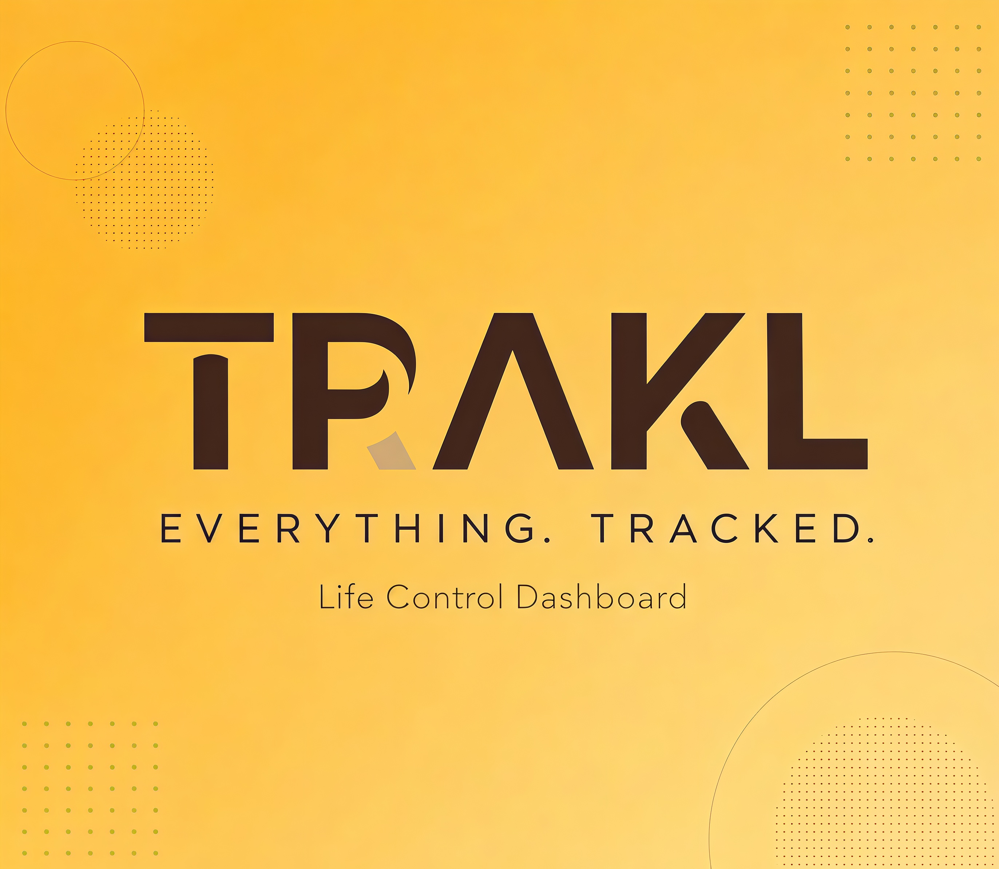
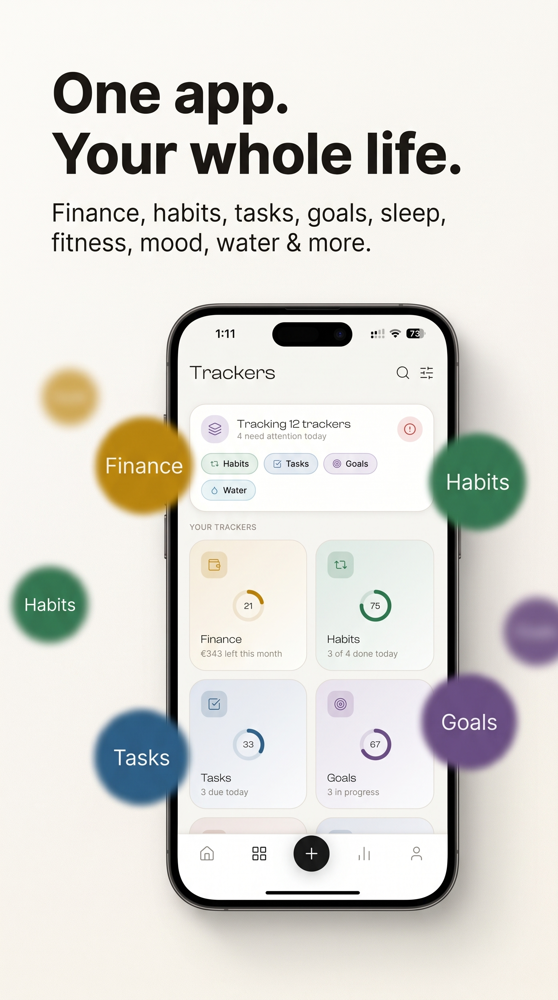
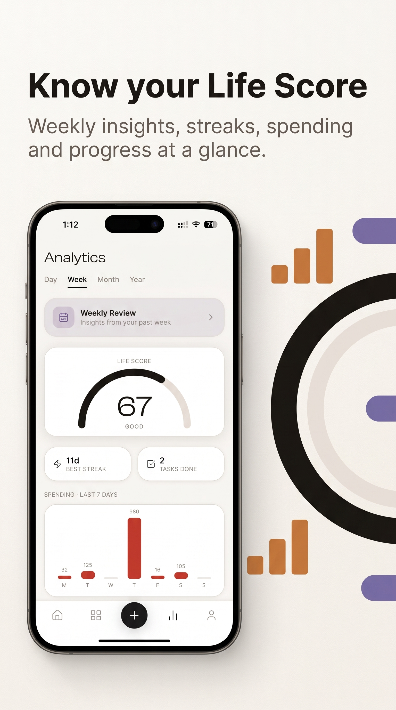
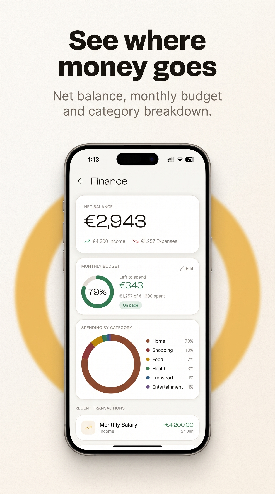
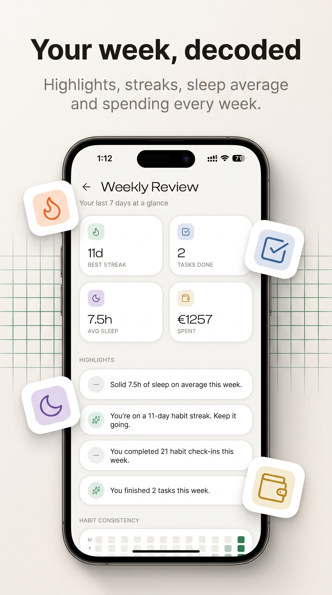
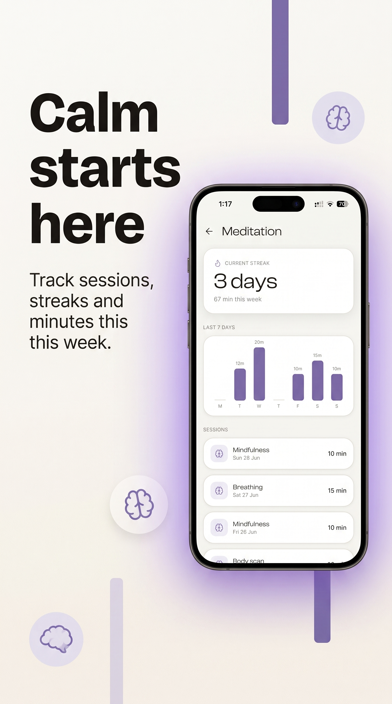

<p align="center">
  
</p>

<div align="center">
  <p>
    Habits, money, sleep, tasks, goals, fitness, mood, water, meditation, and more,<br />
    in one calm app. No account. No cloud. Your data stays on your device.
  </p>

  <p>
    <a href="https://apps.apple.com/gr/app/trakl/id6800000662?l=el">
      
    </a>
    &nbsp;&nbsp;
    <a href="https://play.google.com/store/apps/details?id=trakl.app">
      
    </a>
  </p>

  <p>
    <a href="https://apps.apple.com/gr/app/trakl/id6800000662?l=el">App Store</a>
    ·
    <a href="https://play.google.com/store/apps/details?id=trakl.app">Google Play</a>
    ·
    Free · 20 languages · Local first
  </p>
</div>

<hr />

## Why TRAKL

Most trackers force you to juggle five apps, create an account, and sync your life to someone else's server.

TRAKL is different:

* **One calm dashboard** for habits, money, sleep, tasks, goals, and wellbeing
* **Local first**: tracker entries stay on your phone
* **No signup**: open the app and start logging today
* **Clear insights**: Life Score, streaks, weekly reviews, and spending charts
* **Yours to customize**: build your own trackers when the built-ins are not enough

> [!TIP]
> Free on [App Store](https://apps.apple.com/gr/app/trakl/id6800000662?l=el) and [Google Play](https://play.google.com/store/apps/details?id=trakl.app). Available in **20 languages**, with RTL support.

<hr />

## See it in action

<table>
  <tr>
    <td align="center" width="25%">
      
      <br /><sub>Home</sub>
    </td>
    <td align="center" width="25%">
      
      <br /><sub>Trackers</sub>
    </td>
    <td align="center" width="25%">
      
      <br /><sub>Analytics</sub>
    </td>
    <td align="center" width="25%">
      
      <br /><sub>Finance</sub>
    </td>
  </tr>
  <tr>
    <td align="center" width="25%">
      
      <br /><sub>Tasks</sub>
    </td>
    <td align="center" width="25%">
      
      <br /><sub>Weekly review</sub>
    </td>
    <td align="center" width="25%">
      
      <br /><sub>Sleep</sub>
    </td>
    <td align="center" width="25%">
      
      <br /><sub>Meditation</sub>
    </td>
  </tr>
</table>

<hr />

## What you can track

| Tracker | What you get |
| --- | --- |
| **Home & Life Score** | One daily pulse across habits, money, sleep, and tasks |
| **Finance** | Income, expenses, budget ring, category charts |
| **Habits** | Streaks, check-ins, consistency over time |
| **Tasks** | List + kanban, due dates, priorities, labels |
| **Goals** | Deadlines, milestones, progress |
| **Planner** | Today's focus without spreadsheet chaos |
| **Sleep** | Bedtime, wake time, 7 night trends |
| **Fitness** | Workouts that sit next to the rest of your life |
| **Mood** | Check-ins you can actually stick with |
| **Water** | Simple daily hydration logging |
| **Weight** | Progress without another separate app |
| **Meditation** | Sessions, streaks, weekly minutes |
| **Custom** | Build trackers that fit *your* life |

Plus local reminders, achievements, weekly review, and CSV/JSON backup you control.

<hr />

## Privacy by design

TRAKL is built so a life tracker never needs a server for your personal entries.

* **On device storage** with Zustand + AsyncStorage
* **Encrypted finances** via `expo-secure-store` (iOS Keychain / Android Keystore)
* **No account required** to use the core trackers
* **Ads only after consent** through Google's official UMP flow (plus iOS ATT)
* **Backup you own**: export and import locally, never auto uploaded

See [SECURITY.md](./SECURITY.md) for disclosure policy and fork configuration.

<hr />

## Download

<p align="center">
  <a href="https://apps.apple.com/gr/app/trakl/id6800000662?l=el">
    
  </a>
  &nbsp;&nbsp;
  <a href="https://play.google.com/store/apps/details?id=trakl.app">
    
  </a>
</p>

<p align="center">
  <a href="https://apps.apple.com/gr/app/trakl/id6800000662?l=el"><strong>Download for iPhone</strong></a>
  &nbsp;·&nbsp;
  <a href="https://play.google.com/store/apps/details?id=trakl.app"><strong>Download for Android</strong></a>
</p>

<hr />

## For developers

TRAKL is open source (Expo / React Native). Contributions welcome.

| Layer | Choice |
| --- | --- |
| Framework | Expo SDK 54, React Native 0.81, React 19 |
| Language | TypeScript (strict) |
| Navigation | Expo Router |
| State | Zustand + versioned migrations |
| Secure storage | `expo-secure-store` for financial data |
| Styling | Uniwind / Tailwind (NativeWind) |
| i18n | i18next (20 languages, RTL) |
| Ads | `react-native-google-mobile-ads` + UMP |
| Tests | Jest + Maestro smoke tests |

```text
app/                    Expo Router screens
components/             Presentation UI
src/
  domain/               Tracker definitions (no I/O)
  application/          Store, stats, backup, achievements
  infrastructure/       i18n, notifications, ads, consent, secure storage
  shared/               Theme, fonts, formatting
assets/                 Logo, splash, store creatives
__tests__/              Jest suite
```

### Quick start

```bash
npm ci
npm start          # Expo Go by default
npm run android
npm run ios
npm run web
```

### Quality checks

```bash
npm run typecheck
npm test
npm run lint
npm run knip
npm run semgrep
```

Copy `.env.example` to `.env` for Expo / AdMob identifiers. See `docs/adr/` for architecture decisions.

Dev client builds: set `TRAKL_DEV_CLIENT=1` in a local `.env.local` (ignored by git). Store / production builds leave it unset.

<hr />

## License

**GNU GPL v3** for open source use. Commercial licensing available at commercial@trakl.app.

Full text: [LICENSE](./LICENSE) · Contribute: [CONTRIBUTING.md](./CONTRIBUTING.md) · Security: [SECURITY.md](./SECURITY.md)
